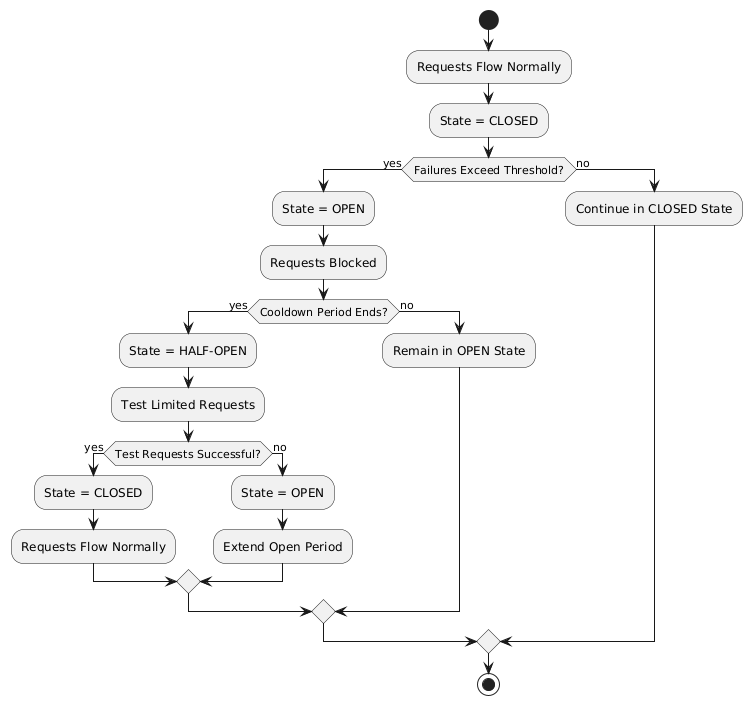

= Chapter 8: MicroProfile Fault Tolerance

In Microservices architecture, an application consists of multiple smaller, autonomous services. It enhances development flexibility, agility, and scalability but introduces new challenges, particularly in ensuring the application's reliability and managing failures. Unlike monolithic applications, where defects are localized, a single failure in one microservice can propagate across the entire application, potentially causing widespread outages. Therefore, fault tolerance is critical for microservices architecture to ensure that failures are seamlessly isolated, managed, and recovered.

*MicroProfile Fault Tolerance* offers strategies for building resilient and reliable microservices, ensuring service continuity and stability even during unexpected failures.

This chapter explains how to enhance your microservices' resilience and reliability using MicroProfile Fault Tolerance capabilities, detailing its annotations. We will also demonstrate how to implement key strategies such as timeouts, retries, fallbacks, circuit breakers, and bulkheads to handle faults. By the end of the chapter, you will understand how to use these strategies to enhance the resilience of your microservices.

== Topics to be Covered
- What is Fault Tolerance?
- Key Strategies for Enhancing Fault Tolerance
- Implementing Retry Policies and Configuration
- Avoiding and Managing Cascading Failures
- Configuring Circuit Breaker
- Setting Timeouts
- Implementing Fallback Logic
- Isolating Resources for Fault Tolerance

== What is Fault Tolerance?

Fault tolerance is a system's ability to continue working correctly even in case of unexpected failures. A fault-tolerant system should be able to detect, isolate, and recover from errors without human intervention. It is critical in applications based on modern microservices architectures where individual component failures are inevitable due to network issues, resource limitations, or transient errors.

== Key Strategies for Enhancing Fault Tolerance

Some of the key strategies for enhancing the fault tolerance of a microservices-based application include:

=== Timeout

A timeout sets a time limit for operations, preventing indefinite waits and freeing up system resources for other tasks. For instance, a timeout in payment service ensures that the application can recover gracefully if the payment processing is taking too long to respond.

=== Retry

A retry allows the system to automatically retry failed operations, particularly useful for handling transient errors like temporary network glitches. You can customize the retry policy with parameters such as the delay between retries and maximum retries. Adding jitter prevents synchronized retries across services.

For example, a payment service can retry a failed payment authorization request with an external payment gateway to ensure successful transaction processing.

=== Bulkhead

A bulkhead isolates failures in one part of a system from other parts by segregating resources, such as thread pools, connection pools, or memory, among different microservices interactions.

For example, in an e-commerce application, the catalog service can implement bulkheads using separate thread pools or connection pools for different upstream dependencies, such as the product database and the pricing service. If the pricing service becomes slow or unresponsive, its dedicated resources (thread pool or connections) prevent it from consuming all the resources of the catalog service, ensuring that requests to fetch product details from the database continue to work unaffected.

=== Fallback

A fallback provides a default response if an operation fails. It ensures the system continues providing a meaningful response instead of completely failing. For example, if the database fails or becomes slow in the product catalog service, the system can fetch cached product data to continue serving user requests for product listings.

=== Circuit Breaker

A circuit breaker stops an application from making too many unsuccessful requests to another system. If the number of failures exceeds a threshold, the circuit breaker will `open`, causing all subsequent requests to fail immediately. After a configured delay, the circuit breaker will `half-open` and allow limited requests. If those requests succeed, the circuit breaker will `close` and let all requests go through.

For example, a circuit breaker can be applied to calls to an external inventory service in the Product Catalog Microservice. If the inventory service starts failing or becomes unresponsive, the circuit breaker will `open`, preventing repeated requests and reducing load. After a configured delay, the circuit breaker will `half-open` to test the availability of the inventory service with a few requests. If those succeed, the circuit breaker will `close`, resuming normal operations.

=== Asynchronous Execution

Asynchronous execution allows operations to run in a separate thread. It means the caller does not have to wait for the operation to finish, making the application more responsive. For example, when a user searches for products in the product catalog service, the service can asynchronously fetch product recommendations from an external API while immediately returning the main search results to the user, ensuring a fast and responsive experience.

When applied individually or in combination, these strategies form the foundation of a fault-tolerant microservices architecture. The following sections delve deeper into their implementation and best practices.

== Fault Tolerance API

The Fault Tolerance API equips developers with annotations to enhance the resilience of microservices against failures. It integrates seamlessly with the MicroProfile Config API, enabling the dynamic configuration of fault tolerance behaviors without modifying the application code. This section will explore using the Fault Tolerance API to build a robust, fault-tolerant microservice.

=== Adding Dependency for Fault Tolerance API

To use the Fault Tolerance API in your project, include the following dependency in your `pom.xml` file. Ensure you specify the version (e.g., 4.1.1) compatible with your MicroProfile runtime.

[source,xml]
----
<dependency>
  <groupId>org.eclipse.microprofile.fault-tolerance</groupId>
  <artifactId>microprofile-fault-tolerance-api</artifactId>
  <version>4.1.1</version>
</dependency>
----

The Fault Tolerance API defines a contract for fault tolerance implementations.

== MicroProfile Fault Tolerance Annotations

The MicroProfile Fault Tolerance annotations provide a declarative way to implement fault-tolerant behavior in Java methods, allowing developers to handle failures gracefully with minimal code changes.

=== List of Annotations

|=== 
| Annotation | Description 
| `@Retry` | Specifies that the annotated method should automatically retry on failure. Parameters such as `maxRetries`, `delay`, `maxDuration`, and `jitter` control retry behavior. Configurations can be externalized using MicroProfile Config.
| `@Timeout` | Specifies the maximum duration (in milliseconds) the method can execute before being aborted. If the timeout is exceeded, a `FaultToleranceException` is thrown. 
| `@CircuitBreaker` | Defines a circuit breaker mechanism to prevent repeated calls to a failing method. Includes parameters like `failureRatio`, `delay`, and `requestVolumeThreshold`.
| `@Fallback` | Specifies alternative logic to execute when the primary method fails. This ensures meaningful responses and graceful degradation.
| `@Bulkhead` | Limits the number of concurrent method executions to isolate system resources and prevent cascading failures.
|===

=== Implementing Retry Policies and Configuration

Retries are a fundamental fault tolerance strategy for managing transient failures such as temporary network outages or intermittent service unavailability. The `@Retry` annotation in the MicroProfile Fault Tolerance API provides a simple and effective way to implement retry policies. By customizing parameters such as the number of retries, delay between attempts, and conditions for retries, you can ensure your application responds to failures gracefully and minimizes downtime.

Below is an example of applying the `@Retry` annotation in a `processPayment` method within a `PaymentService` class of the MicroProfile e-commerce project:

[source,java]
----
package io.microprofile.tutorial.store.payment.service;

import org.eclipse.microprofile.faulttolerance.Retry;
import jakarta.ws.rs.core.Response;
import jakarta.ws.rs.core.MediaType;

public class PaymentService {

    @Retry(
        maxRetries = 3,
        delay = 2000,
        jitter = 500,
        retryOn = PaymentProcessingException.class,
        abortOn = CriticalPaymentException.class
    )
    public Response processPayment(PaymentDetails paymentDetails) throws PaymentProcessingException {
        System.out.println("Processing payment for amount: " + paymentDetails.getAmount());

        // Simulating a transient failure
        if (Math.random() > 0.7) {
            throw new PaymentProcessingException("Temporary payment processing failure");
        }

        return Response.ok("{\"status\":\"success\"}", MediaType.APPLICATION_JSON).build();
    }
}
----

[source,java]
----

class PaymentDetails {
    private double amount;

    public double getAmount() {
        return amount;
    }

    public void setAmount(double amount) {
        this.amount = amount;
    }
}
----

[source,java]
----

package io.microprofile.tutorial.store.payment.exception;

public class PaymentProcessingException extends Exception {
   public PaymentProcessingException(String message) {
       super(message);
   }
}

----

[source,java]
----
package io.microprofile.tutorial.store.payment.exception;

class CriticalPaymentException extends Exception {
    public CriticalPaymentException(String message) {
        super(message);
    }
}
----

In this example, the `processPayment` method attempts to process a payment. If a transient failure occurs (e.g., `PaymentProcessingException`), the method retries up to three times (`maxRetries = 3`), there is a delay of 2000 milliseconds between retries (`delay = 2000`), with a random variation of up to 500 milliseconds is added to the delay (`jitter  = 500`) to avoid synchronized retries (e.g. thundering herd problem). 
The retries are attempted only for the exception `PaymentProcessingException` (`retryOn = PaymentProcessingException.class`) and are aborted if a `CriticalPaymentException` is encountered (`abortOn = CriticalPaymentException.class`).

==== Understanding the `@Retry` Parameters

A retry policy specifies the conditions under which an operation should be retried. The key attributes of the `@Retry` annotation include:

|=== 
| Parameter       | Description 
| `maxRetries`    | Specifies the maximum number of retries.
| `delay`         | Sets the time (in milliseconds) to wait between retry attempts.
| `jitter`        | Adds a random variation (in milliseconds) to the delay to avoid synchronized retries.
| `retryOn`       | Defines the exception(s) that should trigger a retry. Defaults to all exceptions if not specified.
| `abortOn`       | Specifies the exception(s) that should not trigger a retry, overriding the default retry behavior.
| `maxDuration`   | Limits the total time (in milliseconds) that retries can be attempted.
|===

==== Best Practices for Retry Policies

- **Limit Retries:** Avoid setting `maxRetries` too high, as excessive retries can overwhelm the system or cause cascading failures.
- **Use Jitter:** Always configure jitter to reduce the risk of synchronized retry attempts by multiple services.
- **Abort Non-Recoverable Errors:** Use the `abortOn` parameter to exclude critical exceptions that retries cannot resolve.
- **Monitor Metrics:** Integrate with MicroProfile Metrics to track retry patterns and adjust configurations dynamically based on real-world performance.
- **Combine Strategies:** For robust error handling, use retries alongside other fault tolerance mechanisms, such as timeouts and circuit breakers.

=== Avoiding and Managing Cascading Failures

In a distributed microservices architecture, cascading failures occur when the failure of one service propagates to others, potentially causing widespread system outages. Such failures often result from tightly coupled services, unbounded retries, or resource exhaustion.

==== Causes of Cascading Failures

- **Tight Coupling:** Dependencies between services without sufficient isolation mechanisms.
- **Unbounded Retries:** Excessive retries on failing services, overwhelming resources.
- **Resource Contention:** Exhaustion of critical resources such as thread pools, memory, or database connections.
- **Lack of Fail-Safe Mechanisms:** Missing circuit breakers, bulkheads, or fallback logic.

==== Strategies to Prevent Cascading Failures

- Use **circuit breakers** to isolate failing services.
- Apply **bulkheads** to limit the scope of failures and resource usage.
- Set **timeouts** to prevent long-running operations from blocking resources.
- Design retries with care to avoid overwhelming the system.

=== Configuring Circuit Breaker

A circuit breaker is a critical fault tolerance mechanism that protects a system from repeated failures of a dependent service. It stops repeated calls to a failing service, allowing it to recover.

==== Circuit Breaker Parameters

|=== 
| Parameter                 | Description 
| `failureRatio`            | Specifies the proportion of failed requests required to open the circuit breaker.
| `requestVolumeThreshold`  | The minimum number of requests made in a rolling time window before the failure ratio is evaluated.
| `delay`                   | The time (in milliseconds) the circuit breaker remains open before transitioning to the "half-open" state.
| `successThreshold`        | The number of consecutive successful test requests required in the "half-open" state to close the circuit breaker.
| `failOn`                  | Specifies the exception(s) considered failures contributing to the failure ratio.
|===

Below is an example of configuring a circuit breaker for a service method using the `@CircuitBreaker` annotation:

[source,java]
----
@CircuitBreaker(
    requestVolumeThreshold = 10,
    failureRatio = 0.5,
    delay = 5000,
    successThreshold = 2,
    failOn = RuntimeException.class
)
public String getProduct(Long id) {
    // Logic to call the product details service
    if (Math.random() > 0.7) {
        throw new RuntimeException("Simulated service failure");
    }
    return productRepository.findProductById(id);
}
----

In the above code, the circuit breaker opens if 50% of requests fail (`failureRatio = 0.5`) after at least 10 requests (`requestVolumeThreshold = 10`). It remains open for 5 seconds (`delay = 5000`) and transitions to the "half-open" state to test recovery. Two consecutive successful requests (`successThreshold = 2`) in the "half-open" state close the circuit breaker.

==== Best Practices for Circuit Breaker

- **Set Realistic Failure Ratios and Thresholds:** Tailor parameters to your services' expected load and failure behavior.
- **Monitor Metrics:** Use MicroProfile Metrics to monitor circuit breaker state transitions.
- **Combine with Other Strategies:** Use circuit breakers alongside retries and timeouts for a robust fault tolerance setup.

=== Setting Timeouts

Timeouts are an essential fault tolerance strategy to prevent long-running operations from consuming resources indefinitely. Slow or unresponsive services can degrade overall system performance and reliability in a microservices architecture. The `@Timeout` annotation provided by MicroProfile Fault Tolerance allows you to define a maximum duration for a method to complete, ensuring that system resources remain available for other tasks.

==== Why Use Timeouts?

In distributed systems, slow responses from downstream services can cascade through the system, leading to resource contention and degraded performance. Timeouts allow you to:
- Abort operations that exceed acceptable time limits.
- Free system resources for other operations.
- Trigger alternative strategies, such as fallbacks, to maintain functionality.

[source,java]
----
import org.eclipse.microprofile.faulttolerance.Timeout;

public class PaymentService {

    @Timeout(1000)
    public String processPayment(PaymentDetails paymentDetails) {
        // Simulate a long-running process
        try {
            Thread.sleep(1500);
        } catch (InterruptedException e) {
            Thread.currentThread().interrupt();
            throw new RuntimeException("Processing interrupted");
        }
        return "Payment processed successfully.";
    }
}
----

In this example:
- The `@Timeout(1000)` annotation specifies that the `processPayment` method must complete within 1000 milliseconds (1 second).
- If the execution exceeds this time, a `TimeoutException` will be thrown, and the process will terminate.

==== Best Practices for Timeouts

- **Align Timeouts with SLAs:** Ensure timeout values align with service-level agreements and user expectations.
- **Monitor Performance:** Use MicroProfile Metrics to monitor execution times and identify operations requiring optimized timeout values.
- **Combine with Fallbacks:** Always pair timeouts with fallback logic to provide a reliable response in case of delays.
- **Avoid Overly Short Timeouts:** Overly aggressive timeout settings may cause unnecessary failures, particularly in high-latency environments.
- **Combine Timeout with Asynchronous:** Use timeout together with asynchronous to improve responsiveness and prevent blocking the calling thread. This approach ensures better resource utilization and system scalability during long-running operations.

=== Implementing Fallbacks

Fallbacks provide a default response when an operation fails. They ensure the system continues to function, even if the primary operation cannot complete successfully. The `@Fallback` annotation in MicroProfile Fault Tolerance allows developers to define fallback logic for a method, ensuring graceful degradation.

==== Why Use Fallbacks?

Fallbacks help to:
- Maintain system availability during failures.
- Provide a meaningful response to users instead of complete failure.
- Improve user experience by minimizing disruptions.

[source,java]
----
import org.eclipse.microprofile.faulttolerance.Fallback;
import jakarta.ws.rs.core.Response;

public class PaymentService {

    @Fallback(fallbackMethod = "fallbackProcessPayment")
    public Response processPayment(PaymentDetails paymentDetails) {
        // Simulate a failure
        throw new RuntimeException("Service Unavailable");
    }

    public Response fallbackProcessPayment(PaymentDetails paymentDetails) {
        return Response.ok("{\"status\":\"failed\", \"message\":\"Payment service is currently unavailable.\"}").build();
    }
}
----

In this example:
- The `@Fallback` annotation specifies that if the `processPayment` method fails, the `fallbackProcessPayment` method will be executed.
- The fallback method provides a meaningful response, ensuring the user is informed of the service unavailability.

==== Using Fallback Handlers

A fallback handler class can implement the `FallbackHandler<T>` interface, allowing for reusable fallback logic across multiple methods.

[source,java]
----
import org.eclipse.microprofile.faulttolerance.Fallback;
import org.eclipse.microprofile.faulttolerance.FallbackHandler;
import org.eclipse.microprofile.faulttolerance.ExecutionContext;

@Fallback(FallbackHandlerImpl.class)
public class ProductService {

    public String fetchProductDetails(Long productId) {
        throw new RuntimeException("Service Unavailable");
    }
}

public class FallbackHandlerImpl implements FallbackHandler<String> {
    @Override
    public String handle(ExecutionContext context) {
        return "Fallback response for product details.";
    }
}
----

==== Combining Fallbacks with Other Fault Tolerance Strategies

Fallback logic can be combined with other fault tolerance mechanisms to create a robust strategy:
- **Timeout with Fallback:** Ensure operations terminate within a specific time and provide a fallback if they fail.

Example:

[source,java]
----

import org.eclipse.microprofile.faulttolerance.Fallback;
import org.eclipse.microprofile.faulttolerance.Timeout;

import jakarta.enterprise.context.ApplicationScoped;

@ApplicationScoped
public class ProductService {

    @Inject
    private ProductRepository productRepository; // Access to the database

    @Inject
    private ProductCache productCache; // Cache mechanism

    /**
     * Retrieves a list of products. If the operation takes longer than 2 seconds,
     * fallback to cached data.
     */
    @Timeout(2000) // Set timeout to 2 seconds
    @Fallback(fallbackMethod = "getProductsFromCache") // Fallback method
    public List<Product> getProducts() {
        // Simulating database call
        return productRepository.findAllProducts();
    }

    /**
     * Fallback method to retrieve products from the cache.
     */
    public List<Product> getProductsFromCache() {
        System.out.println("Fetching products from cache...");
        return productCache.getCachedProducts();
    }
}
----

This example demonstrates the use of MicroProfile Fault Tolerance annotations `@Timeout` and `@Fallback` to enhance the resilience of a ProductService. The `@Timeout` annotation ensures that the `getProducts()` method, which fetches product data from a database, completes within a specified duration (2 seconds in this case). If the method exceeds this time or an exception occurs, the `@Fallback` annotation directs the application to invoke the `getProductsFromCache()` method, which retrieves data from a cache. This approach ensures consistent service availability and a seamless user experience, even during database delays or failures​.

==== Best Practices for Fallbacks

- **Keep Fallbacks Lightweight:** Ensure fallback logic is simple and reliable, avoiding dependencies on other potentially failing services.
- **Provide Meaningful Responses:** The fallback response should maintain a reasonable user experience, even if it cannot replicate full functionality.
- **Monitor Fallback Usage:** Use metrics to track the frequency of fallback execution, which can indicate service health and the need for improvements.
- **Plan for Degraded Functionality:** Ensure the fallback behavior aligns with business priorities and provides the most critical features.

=== Combining Fault Tolerance Strategies

Combining fault tolerance strategies, such as `@Timeout`, `@Fallback`, `@CircuitBreaker`, and `@Retry`, ensures resilience and efficient resource usage. Externalize configurations with MicroProfile Config for flexibility across environments.

=== Isolating Resources for Fault Tolerance

Resource isolation is a key principle in building resilient microservices. By isolating resources, you prevent failures in one part of the system from spreading and affecting others. MicroProfile Fault Tolerance provides features like bulkheads to achieve resource isolation and ensure critical components remain functional, even when others fail.

==== Why Resource Isolation Matters

In a distributed system, shared resources like thread pools, database connections, and network bandwidth can quickly become bottlenecks if not adequately managed. Resource isolation ensures:
- Failures in one service do not deplete resources for other services.
- Critical operations remain functional even under load or failure conditions.
- Better predictability and control over system behavior.

==== Using Bulkheads to Isolate Resources

Bulkheads are a common pattern for isolating resources by dividing a system into separate pools or partitions. This ensures that a failure in one area does not impact others. The MicroProfile Fault Tolerance standard provides the `@Bulkhead` annotation to implement this pattern.

==== Bulkhead Types

MicroProfile supports two types of bulkheads:
- **Semaphore-Style Bulkhead:** Limits the number of concurrent requests.
- **Thread Pool-Style Bulkhead:** Uses a dedicated thread pool to isolate operations.

===== Semaphore-Style Bulkhead

The semaphore-style bulkhead pattern limits the number of concurrent requests that can be processed by a service or method at any given time. Any additional requests are immediately rejected when the specified concurrency limit is reached. This approach prevents resource contention and protects the system from being overwhelmed during high traffic or failure scenarios.

[source,java]
----
package io.microprofile.tutorial.store.payment.service;

import org.eclipse.microprofile.faulttolerance.Bulkhead;
import jakarta.enterprise.context.ApplicationScoped;
import jakarta.ejb.Asynchronous;

@ApplicationScoped
public class PaymentService {

    /**
     * Processes payment transactions with limited concurrency to prevent
     * system overload and ensure stability during high traffic.
     *
     * The @Bulkhead annotation ensures that only a limited number of
     * concurrent requests (5 in this case) can access this method.
     * The @Asynchronous annotation enables the use of the thread pool
     * style bulkhead for non-blocking execution.
     *
     * @return A success message indicating the processing status.
     */
    @Asynchronous
    @Bulkhead(value = 5)
    public String processPayment() {
        simulateDelay();
        return "Payment processed with limited concurrency.";
    }

    private void simulateDelay() {
        try {
            Thread.sleep(1000); // Simulating a delay
        } catch (InterruptedException e) {
            Thread.currentThread().interrupt();
            throw new RuntimeException("Error during payment processing simulation", e);
        }
    }
}
----

In this example:
- The method allows up to 5 concurrent invocations (`value = 5`).
- Any additional requests are rejected to prevent overload, ensuring system stability.

===== Thread Pool-Style Bulkhead

The thread-pool-style bulkhead pattern leverages a dedicated thread pool to achieve resource isolation. Incoming requests are placed into a queue when all threads in the pool are in use and executed as threads become available. This design helps manage resource contention effectively.

[source,java]
----
package io.microprofile.tutorial.store.payment.service;

import org.eclipse.microprofile.faulttolerance.Bulkhead;
import jakarta.enterprise.context.ApplicationScoped;
import jakarta.ejb.Asynchronous;

@ApplicationScoped
public class PaymentService {

    /**
     * Processes payment transactions with limited concurrency using a thread pool
     * to prevent system overload and ensure stability during high traffic.
     *
     * The @Bulkhead annotation ensures that only a limited number of concurrent
     * requests (5 in this case) can access this method, and the @Asynchronous
     * annotation allows the use of the thread pool style bulkhead.
     *
     * @return A success message indicating the processing status.
     */
    @Asynchronous
    @Bulkhead(value = 5)
    public void processPayment() {
        simulateDelay();
        System.out.println("Payment processed with limited concurrency.");
    }

    private void simulateDelay() {
        try {
            Thread.sleep(1000); // Simulating a delay
        } catch (InterruptedException e) {
            Thread.currentThread().interrupt();
            throw new RuntimeException("Error during payment processing simulation", e);
        }
    }
}

----

In this example:
- The method uses a thread pool with up to 5 concurrent threads (`value = 5`) and a queue of up to 10 tasks (`waitingTaskQueue = 10`).
- This configuration prevents failures in one operation from depleting shared resources.

==== Externalizing Bulkhead Configuration

Bulkhead resource limits can be externalized using MicroProfile Config to allow runtime adjustments. For example:

Annotate the method without specific values:

[source,java]
----
@Bulkhead
public String processPayment() {
    simulatePaymentProcessing();
    return "Payment processed successfully with an isolated thread pool.";
}
----

Define bulkhead parameters in `microprofile-config.properties`:

[source,properties]
----
com.example.Service/dynamicBulkheadOperation/Bulkhead/value=5
com.example.Service/dynamicBulkheadOperation/Bulkhead/waitingTaskQueue=10
----

==== Best Practices for Resource Isolation

- **Isolate Critical Resources:** Use bulkheads for high-priority operations, such as authentication, to ensure they are not impacted by failures elsewhere.
- **Monitor Usage:** Track bulkhead metrics using MicroProfile Metrics to identify bottlenecks and adjust limits.
- **Plan for Scaling:** Test bulkhead configurations under various load conditions to ensure scalability.
- **Combine with Graceful Degradation:** Pair bulkheads with fallbacks to handle rejected requests gracefully.

By effectively isolating resources, you can ensure that your microservices remain reliable and resilient, even in the face of unexpected failures or high demand. This approach not only protects critical operations but also improves overall system stability.

== Summary

This chapter explored the MicroProfile Fault Tolerance API and essential fault tolerance strategies:

- **Retries:** Automatically reattempt failed operations for transient errors.
- **Timeouts:** Define maximum execution times for operations to avoid resource blocking.
- **Circuit Breakers:** Prevent repeated calls to failing services and allow graceful recovery.
- **Bulkheads:** Limit concurrent operations and isolate resource usage.
- **Fallbacks:** Provide meaningful responses during failures.

By leveraging these strategies and combining them effectively, you can design resilient microservices that gracefully handle failures, minimize disruptions, and ensure a seamless user experience.

