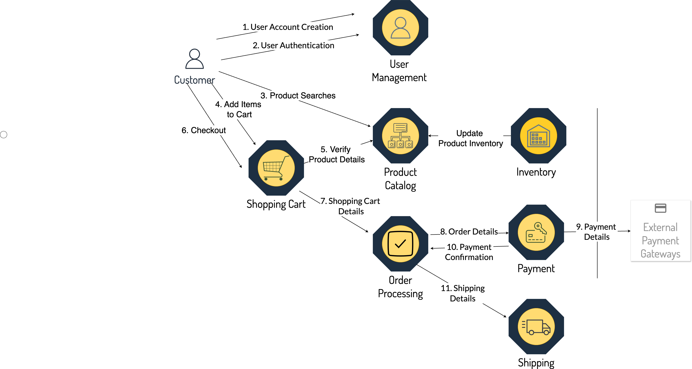

= MicroProfile API Tutorial
:doctype: book

----
MicroProfile API Tutorial

Version: 6.1

Status: Draft
----

== Legal

Copyright (c) 2024 Contributors to the Eclipse Foundation

See the NOTICE file(s) distributed with this work for additional
information regarding copyright ownership.

Licensed under the Apache License, Version 2.0 (the "License");
You may not use this file except in compliance with the License.
You may obtain a copy of the License at

----
     http://www.apache.org/licenses/LICENSE-2.0
----

Unless required by applicable law or agreed to in writing, software
distributed under the License is distributed on an "AS IS" BASIS,
WITHOUT WARRANTIES OR CONDITIONS OF ANY KIND, either express or implied.
See the License for the specific language governing permissions and
limitations under the License.

Oracle and Java are registered trademarks of Oracle and/or its affiliates. Other names may be trademarks of their respective owners.

== Preface

=== About this Tutorial

In this tutorial, you will learn how to use the features of the MicroProfile Platform by building a microservices-based e-commerce application named "MicroProfile e-Commerce". The tutorial will cover using MicroProfile APIs such as Config, REST Client, JWT, Fault Tolerance, and Metrics to build efficient, scalable, and resilient microservices for cloud-native applications. We aim to provide a comprehensive overview and hands-on knowledge about using MicroProfile APIs.

=== Who is this Tutorial for 

This tutorial caters to software professionals, from beginners to senior developers, engineering managers, and architects, to adeptly utilize MicroProfile in real-world projects.

=== What will be Covered

First, an overview of the MicroProfile project is presented, followed by detailed sections on each specification, complete with thoroughly tested and updated code samples.

=== Project

In this tutorial, you will learn to build a microservices-based e-commerce application called "MicroProfile e-Commerce". The app will demonstrate the use of MicroProfile APIs for developing an application based on microservices and cloud-native architecture.

It would include multiple microservices, each serving a different purpose and highlighting different aspects of MicroProfile. Java developers can use this adaptation as a practical case study to implement MicroProfile APIs in real-world applications.

The MicroProfile e-Commerce application compirses of multiple microservices, among the key ones are as below:

- **Product Catalog**: This service acts as the central repository for all product-related information, including detailed descriptions, pricing, and inventory levels. It provides APIs for fetching product details efficiently for the other microservices, such as the Shopping Cart. This microservice is vital for updating product data, ensuring data consistency and accuracy across the e-Commerce platform.

- **The Shopping Cart**: This service allows users to add or remove products from their shopping cart. It communicates with the Product Catalog Microservice to access up-to-date product information. It handles the storage and management of cart items for each user, including the calculation of cart totals with applicable discounts or promotions. This microservice plays interfaces with the Checkout microservice to initiate the order processing.

- **User Management**: This service is responsible for user account management, handles registration, login, and account updates securely using JWT tokens. It is essential for personalizing the user experience and safeguarding user information.

- **Order Processing**: This service manages the entire order process, from collecting shipping information and confirming order details to initiating payment processing. This microservice ensures a seamless transition from shopping to order completion.

- **Payment**: Dedicated to processing payments, this microservice interacts with external payment gateways to securely handle transactions. It receives payment instructions from the Checkout microservice, executes the payment process, and confirms transaction outcomes. This microservice is crucial for ensuring financial transactions are conducted securely and efficiently, maintaining the integrity of the payment process.

- **Inventory**: This service is dedicated to monitoring and managing inventory levels. It tracks product availability, updates inventory in real-time as sales occu, and provides restocking alerts. By integrating with the Product Catalog and Checkout microservices, it ensures that product availability is accurately reflected on the platform and that orders are only placed for in-stock items. This microservice is crucial for maintaining optimal inventory levels and preventing stockouts, thereby enhancing the customer shopping experience.

- **Shipping**: This microservice is responsible for managing the logistics of order delivery. It receives order details and shipping information from the Order Processing Microservice, ensuring that orders are shipped to customers in a timely and efficient manner. The Shipping Microservice plays a critical role in the post-purchase customer experience, managing expectations and communication regarding order delivery.

:figure-caption: Figure 
.MicroProfile e-Commerce Application

As you can see in the above figure, together these microservices form a robust and flexible e-Commerce application architecture, enabling scalable, efficient, and secure online shopping experiences.

=== Downloading the Code
The code examples in this tutorial are available at this link:https://www.github.com/ttelang/microprofile-examples[repo] (TODO: to be changed).

=== Prerequisites
MicroProfile use the Java Platform, and are usually written in the Java programming language. 
All the examples in this tutorial are written in Java. 
If you're new to Java, spend some time getting up to speed on the language and platform;
a good place to start is https://dev.java/learn/[dev.java/learn].

Each topic in this tutorial provides some background information, 
but in general,
we assume you have a basic understanding of RESTful Web Services. 

=== Learning Objectives

. Understanding MicroProfile and Its Ecosystem: 

.. Gain a solid understanding of what MicroProfile is and its role in modern cloud-native application development.

.. Learn about the evolution of MicroProfile and its relationship with Jakarta EE.

.. Understand how MicroProfile facilitates building microservices.

. Hands-On Experience with Key MicroProfile APIs:

.. Learn to implement Config, Health Check, Metrics, JWT Authentication, Fault Tolerance, Rest Client, and other MicroProfile APIs.

.. Understand how to apply these APIs in practical scenarios through the Duke's Forest application case study.

. Building Resilient and Scalable Services:

.. Master techniques for developing resilient services using fault tolerance and health checks.

. Securing Microservices:

.. Learn the intricacies of securing microservices using MicroProfile JWT and Security API.

. Effective Data Management in Microservices:

.. Understand the role of JPA and JSON-B in MicroProfile for handling data operations in microservices.

. Monitoring and Tracing:

.. Implement monitoring strategies using MicroProfile Metrics.

.. Learn to trace microservice interactions with OpenTracing for enhanced observability.

. Collaborative Learning and Community Engagement:

.. Participate in Q&A sessions, forums, and interactive discussions.

.. Engage with the MicroProfile community for continuous learning and staying updated with the latest trends.

By the end of this tutorial readers will gain the knowledge and skills necessary to design, develop, and deploy robust microservices using MicroProfile, preparing them for advanced roles in software development and architecture in cloud-native environments.

== Conventions
[width="99%",cols="20%,38%,37%"]
|===
|Convention |Meaning |Example

|*Boldface* |Boldface type indicates a term defined in text or graphical user interface elements associated with an action. |A *cache* is a copy stored locally.

From the *File* menu, choose *Open Project*.

|`Monospace` |Monospace type indicates the names of files and directories, commands within a paragraph, URLs, code in examples, text that appears on the screen, or text that you enter. |Edit your `.login` file.

Use `ls -a` to list all files.

`_machine_name_% you have mail.`

|_Italic_ |Italic type indicates book titles, emphasis, or placeholder variables for which you supply particular values. |Read Chapter 6 in the _User's Guide_.

Do _not_ save the file.

The command to remove a file is `rm _filename_`.
|===
